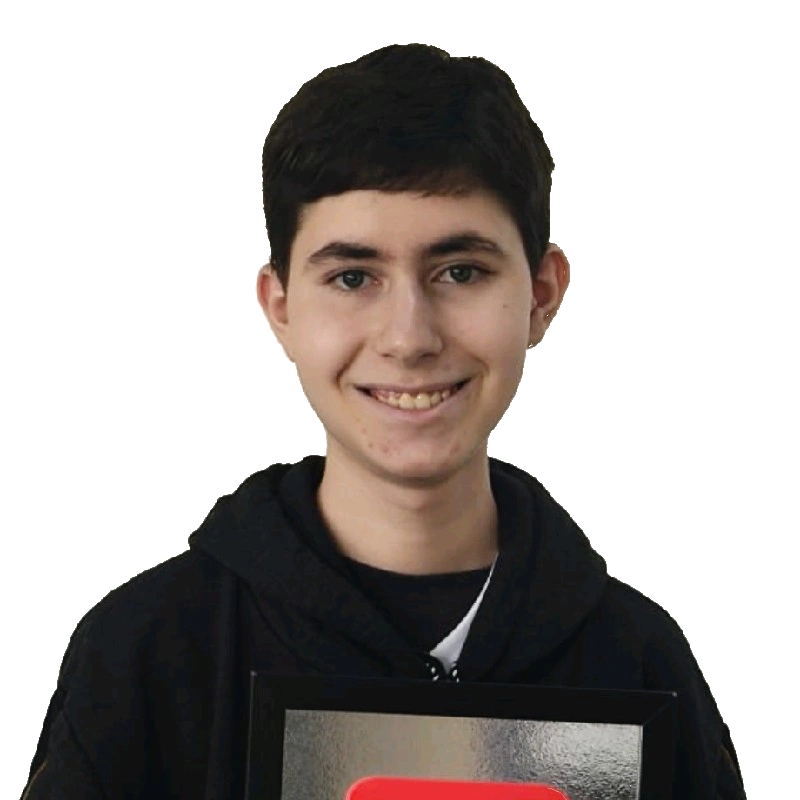

# 🚀 Meu Portfólio de Projetos

  
  

  Portfólio desenvolvido para apresentar meus projetos, habilidades e experiências na área de tecnologia.

---

## 👨‍💻 Sobre Mim

Olá! Sou **Matheus Eduardo Custódio Souza**, Concluí o Ensino Médio com formação técnica em Tecnologia e Robótica pela Alura.

Tenho interesse em:

- Desenvolvimento Web
- Programação
- Criação de Jogos
- Animação Digital
- Tecnologia e Inovação
- Modelagem 3D
- Edição de Vídeo

Atualmente estou em busca da minha primeira oportunidade como **Jovem Aprendiz**, **Estagiário** ou **Desenvolvedor em formação**.

---

## 🛠️ Tecnologias Utilizadas

- HTML5
- CSS3
- JavaScript
- Bootstrap 5

---

## 📂 Projetos

### 🎮 Sliding Puzzle 3x3
Jogo de lógica onde o objetivo é organizar as peças numeradas na posição correta.

### 🌲 Aventura na Floresta Sombria
Site interativo com narrativa e elementos de exploração.

### 🎬 Animafrix
Projeto voltado para entretenimento e animação digital.

### 📚 Biblioteca Digital
Sistema para organização e exibição de conteúdos digitais.

---

## 📱 Responsividade

O site foi desenvolvido para funcionar em:

- 💻 Computadores
- 📱 Smartphones
- 📟 Tablets
